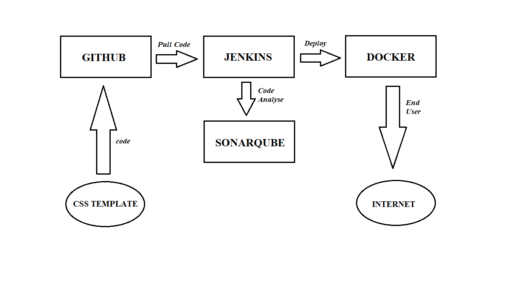

# CICD PIPELINE – GITHUB, JENKINS, SONARQUBE, DOCKER

This is project on using Github, Jenkins, Sonarqube and docker to do Continuous Integration and Continuous Deployment

## INTRODUCTION

* "CI" represents continuous Integration and “CD” represents continuous Deployment, A CI/CD pipeline is an automated process in the streamline of creation, testing and deployment of application.

* Devops tools which makes CICD more simple and effective, in this project we use Github, Jenkins, Sonarqube and Docker.

## OBJECTIVES
* Creating separate instance for Jenkins, Sonarqube and Docker and connecting all with the appropriate plugins installed in Jenkins.

* Pull the code from Github by webhook to Jenkins and make this to verify code in Sonarqube and deploy a container in Docker.

## PREREQUISITES
* Familiarity with the AWS Management Console.

* Ec2 instance with minimum of t2.medium for storage capacity.

* Familiarity with Github, Jenkins, Sonarqube, Docker.

* Management plugins to give across connection. 

## AWS SERVICES USED
* **Amazon Elastic Compute Cloud (Amazon EC2):** EC2 instance is a Web Services, which allows users to rent virtual computers (servers) on which to run their own applications. Jenkins, Sonarqube and docker are installed and started in ec2 instance to host in internet.

## DEVOPS TOOLS USED
* **GitHub:** GitHub ia a web-based interface that use git, the open source version. It let you to host, share & manage your code file on the internet by creating the repository in GitHub. This project we create repo and store details and make a webhook of that to Jenkins.

* **Jenkins:** Jenkins is a java based open source automation platform with plugins designed for continuous integration related to building, testing, deploying and facilitating. Here we connect all tools to Jenkins to make CI & CD.

* **Sonarqube:** Sonarqube is a self-managed, automatic code review tool that helps to deliver a clean code, where sonarqube scanner plugin is used to scan job from Jenkins make it verify for integrating.

* **Docker:** Docker ia software platform that allows to build, test & deploy application quickly. This project we create container from the code we get from Github through Jenkins which is verified by Sonarqube.

# PROJECT EXECUTION STEPS
## STEP 1: GITHUB
* Create a repository in a github.

* Download sample CSS template from google and upload that template into the github repo.

## STEP 2: CONSTRUCTION OF JENKINS

* Create an EC2 instance with instance type t2.medium for extra memory and with security group inbound rule enabling port 8080 which helps to run the Jenkins in internet.

* Install java and Jenkins package in instance (get Jenkins package commands from https://pkg.jenkins.io/debian-stable/).

* After installing the package, start the jenkins and copy public ip and hit the internet with port no. 8080.

* Install the plugins and login to the Jenkins GUI.

## STEP 3: CONNECTING GITHUB WITH JENKINS

* In github repo, create a webhook for pull and push request by attaching the Jenkins ip-address along with port no.

* In Jenkins, create freestyle job with providing git repo url and repo branch along with github hook trigger.

* Run a job and check whether github repo is connected with Jenkins. After connecting, whatever changes made in github repo will be directly modify in the Jenkins workspace.

## STEP 4: CONSTRUCTION OF SONARQUBE
* Create an EC2 instance with instance type t2.medium for extra memory and with security group inbound rule enabling port 9000 which helps to run the sonarqube in internet.

* Install java and sonarqube package in instance (get sonarqube package link https://binaries.sonarsource.com/Distribution/sonarqube/sonarqube-10.6.0.92116.zip and extract it).

* Start the sonarqube and copy public ip and hit the internet with port no. 9000 and login to sonarqube GUI.

*  Create a project in sonarqube under Jenkins CI and generate private key and token, save both for later use. 

## STEP 5: CONNECTING SONARQUBE WITH JENKINS
* In Jenkins GUI install Sonarqube Scanner and SSH2 plugins and add it to the tool to manage.

* In system, add sonarqube server by attaching sonarqube ip-address along with port no. and the token created earlier.

* Modify the created job by adding project key in execute sonarqube scanner and run a job.

* In sonarqube, the Jenkins jobs result will be notified as success and now sonarqube is connected with Jenkins.

## STEP 6: CONSTRUCTION OF DOCKER
* Create an EC2 instance with instance type t2.medium for extra memory and with security group inbound rule enabling port 80 which helps to run the docker containers in internet.

* Update and install docker in an instance using docker.io and modify the public key authentication to connect with Jenkins terminal.

## STEP 7: CONNECTING DOCKER WITH JENKINS
* Generate a key pair in Jenkins and copy it to the docker to connect across terminals from Jenkins to docker.

* In Jenkins GUI, configure the docker user and password under server group center and attach that to the server list by attaching docker ip-address.

* Run a build job in Jenkins to verify the connectivity between Jenkins and docker.

## STEP 8: EXECUTION  
* Write a Dockerfile to create nginx to execute in internet and paste that dockerfile in github repo.

* In Jenkins, add execute shell to move all file in Jenkins workspace to directory created in docker.

* Add remote shell give commands to build docker image through the dockerfile copied to the docker directory and from that docker image create a docker container with port forwarding.

* After all the setup added run the job.

* Modify and add port forwarded no. to security group. 

* Copy the docker instance ip-address and hit the internet with given port no. for the container, now we can see the css template which uploaded in the github repo.

* The css template from github repo comes through Jenkins and verified by sonarqube and created a container using docker file and moved the template to the middleware of the nginx and display in the internet across through all.

## CHALLENGES FACED
* Challenges faced in connecting Jenkin and Docker terminal through ssh, which required to modify the sshd_config file in docker.

* To execute the docker command via Jenkins docker has need to give certain permissions to add docker user in a group that accepts command.

## LESSON LEARNED
* Working on a project like CI-CD pipeline provides a hands-on learning experience on how exactly webhook works and remote shell in Jenkins works and deployment across devops tools works.

* Building such a project gave a knowledge to connect across terminals and way to succeed by overcome mistakes and error.

* Learned needed much more attention while installing the packages in the Ec2 instance and to start those services.

## OUTPUT FLOW DIAGRAM

