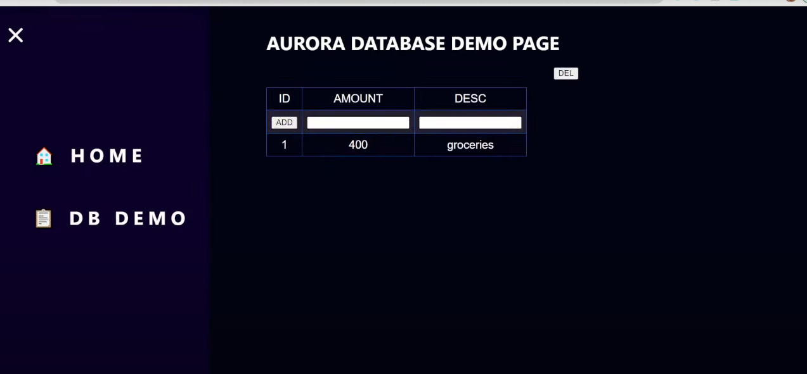

# AWS THREE TIER WEB ARCHITECTURE

A project on making the 3-tier web architecture which connects in the stream of database, app tier, internal load balancer, web tier, internet facing load balancer and direct it to the internet gateway.

## INTRODUCTION

* AWS (Amazon Web Service) which provides on-demand cloud platform which ease the most of the process by connecting services.

* The aws three-tier web architecture is the most popular implementation of a multi-tier architecture and consists of a single web tier, app tier, and database tier. 

* The project where database tier stores all the data which are to be accessed and processed by the app tier and which connects with the web tier to get access with internet.

## OBJECTIVES
* Manually creating the necessary network, security, and database components and configurations in order to run this architecture in an available and scalable manner.

* The objective of this project is to connect in the stream of database, app tier, internal load balancer, web tier, internet facing load balancer and direct it to the internet gateway.

## PREREQUISITES
* Familiarity with the AWS Management Console.
* Familiarity with VPC network structures, EC2 instances, Auto scaling groups and security group.
* Familiarity with Linux commands.
* Access to command line tool.

## AWS SERVICES USED
* **AWS Identify and Access Management (IAM):**  	IAM is a web service for securely controlling access to AWS resources. It enables you to create and limit access by using IAM roles which is to be attached with EC2-instance.

* **Amazon Elastic Compute Cloud (Amazon EC2):** EC2 instance is a Web Services, which allows users to rent virtual computers (servers) on which to run their own applications. App and Web instance are created and made into template to connect with auto-scaling to control traffics.

* **Amazon Simple Storage Service (Amazon S3):** S3 is an object storage service that store and retrieve any amount of data at any time. App tier and web tier configuration data is stored in S3 bucket.

* **Amazon Virtual Private Cloud (VPC):** VPC is a private cloud computing environment contained within a public cloud. It is a service that allows its users to launch their virtual machines in a protected as well as isolated virtual environment for three tier architecture.
* 
* **Amazon Relational Database Service (Amazon RDS):** RDS is a web service that makes it easier to set up, operate, and scale a relational database in the AWS Cloud. Aurora database is created with Aurora replica to store and access data.

# PROJECT EXECUTION STEPS
## STEP 1: INITIAL SETUP
**a)	Download code from GitHub:**
* Using git clone https://github.com/aws-samples/aws-three-tier-web-architecture-workshop.git, download the required files to the local drive.
* 
**b)	Creation of S3 bucket:**
* Creating S3 bucket with ACL disabled and public access blocked to store the downloaded files in it.
* 
**c)	Creation of IAM role for EC2 Instance:**
* Create a role for EC2 with policies allowing access to SSM managed instance core and S3 read only.

## STEP 2: NETWORKING AND SECURITY
**a)	VPC and Subnets:**
* Create a VPC to get a separate private cloud space with CIDR block 10.0.0.0/16. 

* Create subnets with a new VPC created, in availability zone (AZ1 & AZ2) with each has one subnet create two public subnets for web tier, two private subnets for app tier and two DB private subnets for database tier. (Total of 6 subnets in 2 different availability zones).

**b)	Internet Connectivity (IGW & NATGW):**
* Create internet gateway and attach it with a VPC

* Create NAT gateway for availability zone -1 using public subnet -1 and allocate elastic IP. 

* Create NAT gateway for availability zone -2 using public subnet -2 and allocate elastic IP.

**c)	Routing Configuration:**
* Create two route table one for public and another one for private.

* In public route table, add internet gateway and associate public subnet -1&2 which are in both AZ-1&2.

* In private route table, add NAT gateway and associate private subnet -1.

**d)	Security Groups:**
* Create **Internet facing-lb** security group with inbound rule having HTTP with My IP source.

* Create **web-tier** security group with inbound rule having HTTP with my IP source and HTTP with internet facing-lb-sg source.

* Create **Internal-lb** security group with inbound rule having HTTP with webtier-sg source.

* Create **app-tier** security group with inbound rule having 	Custom TCP with port no. 4000 with internal-lb-sg source and My IP source.

* Create **Database** security group with inbound having Mysql/Aurora with app-tier-sg source.

## STEP 3: DATABASE DEPLOYMENT
**a)	Database Subnet group:**
* Create subnet group in database by adding two DB private subnet which was created earlier by selecting two availability zones.

**b)	Creation of Database:**
* Create Aurora (Mysql) database under created VPC for dev/test, attach database subnet group, database security group and give password authentication to make it more secured.

* Create Aurora replica for the backup of that created database which stores the sensitive messages.

* After creating the database check for the reader and writer instance is created in a database.

## STEP 4: APP TIER INSTANCE DEPLOYMENT
**a)	Creation of App instance:**
* Launch Ec-2 instance with linux OS specified with created VPC, Private subnet -1and app-tier security group attached with IAM role created.

* Public IP is not assigned for this instance as it is under private subnets. 

**b)	Configure Database:**
* Install Mysql in the created instance. 

* Attach database by using RDS endpoint and create table and enter sample data in it. 

**c)	Configure App Instance:**
* Modify the database config file in the app tier folder by adding host name, user, password and database name and upload it in to the S3 bucket under app tier folder.

* Move the modified app tier folder from S3 bucket to instance and start the database.

* Check whether the database is attached properly and its working on the given port and make sure for health check of them.

## STEP 5: INTERNAL LOAD BALANCER & AUTO SCALING
**a)	Creation of AMI and target group for App-tier instance:**
* Create an image from the database configured app-tier instance to launch a template using this AMI.

* Create target group for app-tier instance with port 4000 for HTTP with a specified VPC and give required health check settings for it. 

**b)	Creation of Internal load balancer:**
* Create an application load balancer with scheme of internal (i.e. the load balancer which does not connect with internet).

* Map the network to both private subnet -1&2 in both availability zone under specified VPC.

* Configure the internal-lb security group and target group which created earlier to listen and route.

**c)	Launching a template:**
* Create a launch template by using the AMI created from the modified app-tier instance, adding with app-tier security group and IAM role which we created.

**d)	Creation of Auto scaling group:**
* Create auto scaling group by attaching the created launch template of app-tier instance.

* Attach both private subnet -1&2 from both availability zones and attach the created internal load balancer and target group.

* Make a desired, minimum and maximum capacity to be 2 where we can restrict to create only 2 instances.

## STEP 6: WEB TIER INSTANCE DEPLOYMENT
**a)	Update & Upload config file in S3:**
* Modify and attach the internal load balancer DNS name into the config file which is downloaded from github along with app and web tier file.

* Upload that modified config file and webtier folder into the created S3 bucket.

**b)	Creation of web instance:**
* Launch Ec-2 instance with linux OS specified with created VPC, Public subnet -1and web-tier security group attached with IAM role created.

* Public IP is assigned for this instance as it is under public subnets.

**c)	Configure web instance:**
* Move the web tier folder and config file modified with internal laod balancer DNS name from S3 bucket to instance.

* Install nvm and nginx in the instance and start both of them(the config file which attached Dns is nginx config file).

* Replace the nginx config file with the modified one and restart the nginx.

## STEP 7: EXTERNAL LOAD BALANCER & AUTOSCALING
**a)	Creation of AMI and target group for Web-tier instance:**
* Create an image from the nginx configured web-tier instance to launch a template using this AMI.

* Create target group for web-tier instance with port 80 for HTTP with a specified VPC and give required health check settings for it.

**b)	Creation of Internet facing load balancer:**
* Create an application load balancer with scheme of internet facing (i.e. the load balancer which connects with internet).

* Map the network to both public subnet -1&2 in both availability zone under specified VPC.

* Configure the Internet facing-lb security group and target group which created earlier to listen and route.

**c)	Launching a template:**
* Create a launch template by using the AMI created from the modified web-tier instance, adding with web-tier security group and IAM role which we created.

**d)	Creation of Auto scaling group:**
* Create auto scaling group by attaching the created launch template of web-tier instance.

* Attach both public	 subnet -1&2 from both availability zones and attach the created internet facing load balancer and target group.

* Make a desired, minimum and maximum capacity to be 2 where we can restrict to create only 2 instances.

## STEP 8: THE RESULT
* Copy and hit the web-tier load balancer DNS name in internet, now we can see the output and under DB demo we can see the attached data through database.

## CHALLENGES FACED
* Challenges faced in assigning correct public and private subnet at the correct location.

* Configuring database in app-tier instance faced challenges because of commands related to mysql and attaching database are different and that I took from the documentation, still I faced so much error in executing.

* Configuring nginx config file in web-tier instance faced challenges because of commands and I took from documentation and faced error executing it.

## LESSON LEARNED
* Working on a project like 3-tier architecture provides a hands-on learning experience on how exactly VPC and RDS works and how traffic is maintained by load balancer and distributed to auto scaling group.

* Building up setup of 3-tier gave exposure to most of the AWS services.

* Error can occur even if we follow the exact step in documentation because of the version we use and configuration we make.

## OUTPUT SCREENSHOT 

